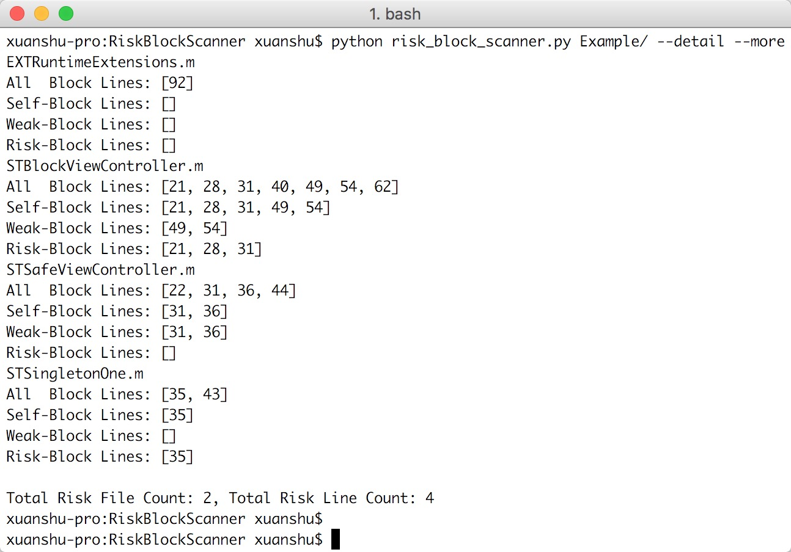

# RiskBlockScanner

RiskBlockScanner is a static code text scanner. RiskBlockScanner could detect cycle reference problem which cause by block.

* RiskBlockScanner can detect self ref self block problem only now
* RiskBlockScanner still in improvement.
* XCode Plugin is developing

RiskBlockScanner是针对iOS(Mac)平台的静态代码扫描器。通过RiskBlockScanner可以查找代码中潜在循环引用风险的Block使用。

* 该库实用价值较高
* 目前仍在改进完善
* XCode插件编写中

## Feature

Detect Simple Self-Block Cycle Reference by scan code files.

检查最简单的被self引用的block内部使用self导致的循环引用



## Usage

``` Swift
python risk_block_scanner.py [目标文件] 
```

#### Optional
* ```--detail```         
	* show detail info of risk files
* ```--more```          
	* show detail info of all files
* ```--show-singleton``` 
	* singleton is excluded default. use `--show-singleton` to make singleton be included.
* ```--show-filepath```
	* show whole filepath replace filename
	
#### 可选参数
* ```--detail``` 
	* 显示潜在循环引用文件的详细信息
* ```--more```   
	* 显示所有文件的详细信息
* ```--show-singleton```
	* 默认情况下, 单例类的循环引用默认是安全的; 可以通过该参数让单例类的循环引用也和普通类一同处理扫描;
* ```--show-filepath```
	* 显示完整路径名, 防止同名文件误导

## Requirement

Python 2.6+

## License

RiskBlockScanner is available under the MIT license. See the LICENSE file for more info.